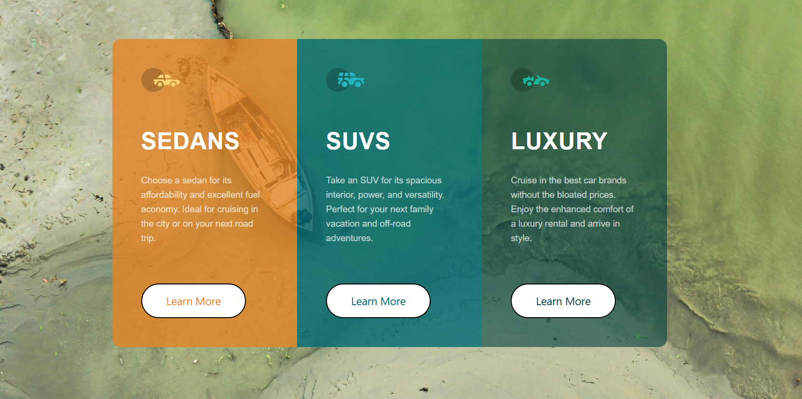

# 3-Column Preview Card Component

A responsive **3-column preview card UI** built using **HTML + CSS (Flexbox)** as part of a **Frontend Mentor** challenge.  
This project includes clean spacing, hover effects, and a fully mobile-friendly layout.

---

## 🚀 Live Demo
https://golu-dhama.github.io/3-column-preview-card/

---

## 📸 Preview
### Desktop

### Mobile

---

## 🛠️ Built With
- HTML5
- CSS3
- Flexbox
- Media Queries (Responsive Design)

---

## ✨ Features
✅ 3-column layout on desktop  
✅ Stacked layout on mobile  
✅ Equal-width cards using `flex: 1`  
✅ Hover effects on cards + buttons  
✅ Clean padding and spacing system  

---

